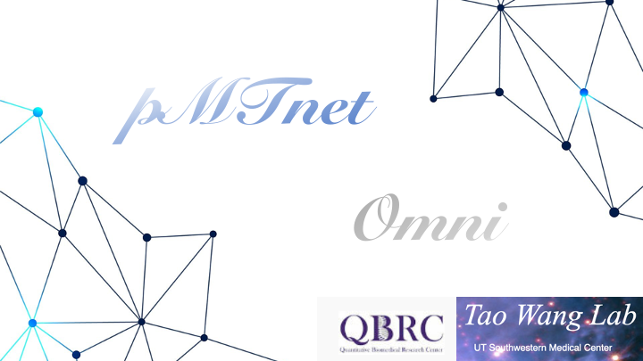
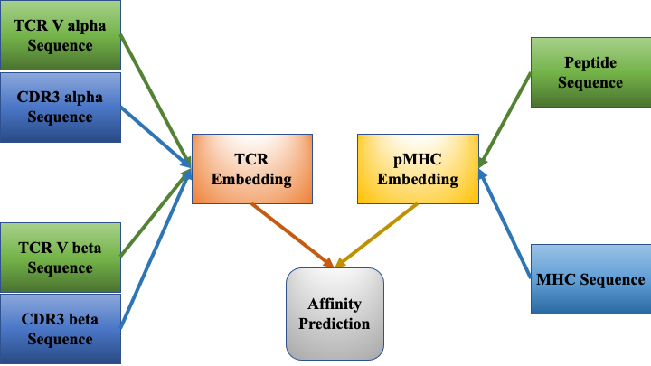

.. pMTnet_Omni documentation master file, created by
   sphinx-quickstart on Wed Dec 14 11:36:34 2022.
   You can adapt this file completely to your liking, but it should at least
   contain the root `toctree` directive.

**pMTnet Omni**: your one-stop TCR-pMHC affinity prediction algorithm
===========================================================================

**pMTnet Omni** is a deep learning algorithm for affinity prediction based on 
TCR Va, Vb, CDR3a, CDR3b sequences, peptide sequence, and MHC allele types.
The predictions can be made for human and mouse alleles, 
and for both CD8 T cells/MHC class I and CD4 T cells/MHC class II.

Here is a quick overview of the structure of the model:

For a more detailed exploration of our model, please refer to `our paper <https://doi.org/10.1101/2023.12.01.569599>`_:

*pMTnet Omni Paper citation here*

The online tool are hosted on `DBAI <http://lce-test.biohpc.swmed.edu/pmtnet>`_ where you can upload
your own dataset and we will crunch the numbers for you. 

In this document, we will mainly focus on two aspects:

Input Format
   A series of detailed explanations as well as functions will be provided to help you organize your dataset so that 
   the input can be correctly recognized by **pMTnet Omni**.

Input Parameters 
   **pMTnet Omni** can be configured in a various ways to suit your own need. We will walk through 
   the parameters you can use to alter the behaviors of our algorithm.

Dependencies
--------------

The dependencies of pMTnet Omni Document is fairly standard for a deep learning-based application

.. list-table:: Dependencies
  :widths: 50 50
  :align: center
  :header-rows: 1

  * - Package 
    - Version 
  * - python
    - ``>=3.9``  
  * - numpy
    - ``==1.22.4``
  * - pandas
    - ``==1.5.2``
  * - tqdm 
    - ``==4.64.1``
  * - torch
    - ``==1.13.1``
  * - fair-esm
    - ``==2.0.0``

Installation
--------------------------------

.. note:: 
   We highly recommend creating a virtual environment before 
   proceeding to installing the package. For how to manage virtual
   environment via ``conda``, check out 
   `their tutorial <https://conda.io/projects/conda/en/latest/user-guide/tasks/manage-environments.html#>`_.

.. code:: bash
   
   pip install pMTnet_Omni_Document

To quickly test if it has been installed:

.. code:: bash

  python -m pMTnet_Omni_Document --version 

User Guide / Tutorial
=====================
.. toctree::
   :maxdepth: 1
   :caption: Get Started

   quick_start
   
.. toctree::
   :maxdepth: 3
   :caption: Input Format

   input_format/index

.. toctree::
   :maxdepth: 1
   :caption: Detailed Tutorials

   tutorial/data_curation
   tutorial/details

.. toctree::
   :maxdepth: 2
   :caption: API Reference

   api_reference/index

Indices and tables
==================

* :ref:`genindex`
* :ref:`modindex`
* :ref:`search`
