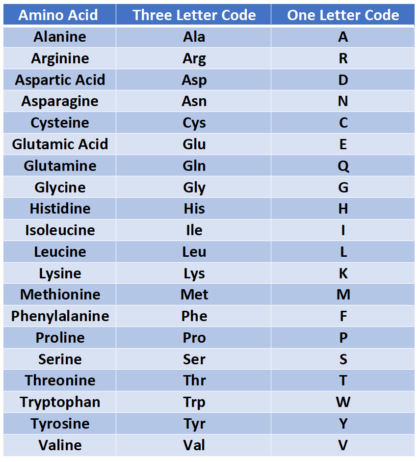

Amino Acids Sequences Format
=============================
Columns that ``read_file`` expect to contain sequences of 
amino acids are 

.. list-table:: Columns of Amino Acids (AA) Sequences
   :align: center 
   :widths: 30 70 
   :header-rows: 1

   * - Name 
     - Meaning 
   * - vaseq 
     - The AA sequence the Alpha chain for the V segment
   * - vbseq
     - The AA sequence the Beta chain for the V segment
   * - cdr3a
     - The sequence of amino acids for the CDR3 region on the Alpha chain
   * - cdr3b
     - The sequence of amino acids for the CDR3 region on the Beta chain
   * - peptide 
     - The sequence of amino acids presented by the MHC
   * - mhcseq
     - The sequence(s) of amino acids of the corresponding MHC

.. warning:: 
  For ``vaseq`` (resp. ``vbseq``), if the corresponding gene/allele names in 
  ``va`` (resp. ``vb``) are provided, the sequences will be ignored. If the names 
  can not be found in the reference data provided in ``./validation_data``, the 
  corresponding records will be dropped. **Only** when 
  the names are not supplied will we utilize the information given in these two columns. 
  
.. warning:: 
  For ``mhcseq``, if the corresponding gene/allele names in 
  ``mhc`` are provided, we will first look up the corresponding
  sequences using our own reference data. **Only** when 
  the names can not be found in our reference data will we utilize 
  the information given in this column. 

Overall 
-----------
The **one-letter code** of the following 20 Amino Acids are 
accepted by **pMTnet Omni**. 

.. note:: 
   If a letter in a provided sequence is not of the 20 amino acids
   (this includes cases such as unknown amnio acids\: ``X``, 
   white spaces\: :literal:`\ `, special characters\: ``_, +, /`` etc.),  
   it will first be replaced by ``_``. When converting to a matrix of 
   Atchley Factors, those ``_`` will be interpreted as ``0,0,0,0,0``.

vaseq, vbseq 
---------------

.. warning:: 
    If ``va`` (resp. ``vb``) is provided, we will perform a 
    look-up using our `reference database` provided in 
    ``./validation_data`` **regardless** 
    of the presence of ``vaseq`` (resp. ``vbseq``). **Only** when 
    ``va`` (resp. ``vb``) is missing will the algorithm utilize the 
    actual sequence. 

.. tip:: 
    For new TCR sequences (for instance when performing TCR optimization),
    simply supply ``vaseq`` and ``vbseq`` and leave ``va`` and 
    ``vb`` blank.

When using information provided in these two columns, minimal 
data curation will be performed. Therefore, it's vital to make sure that the format of 
your input sequences conforms with ours. One such mismatch
could happen when the users **truncate the CDR3 part of a sequence**.

.. warning:: 
    **Do not truncate the CDR3 part of a sequence.**

cdr3a, cdr3b 
---------------
CDR3s usually start from C and end with F. 
We are aware of different definitions of CDR3s that result 
in slightly different start and end boundaries of CDR3s. 

.. note:: 
   We will directly use the sequences provided in these two 
   columns with minimal data curation. Therefore, 
   please use the definition that is consistent with ours.

peptide 
----------------
.. warning:: 
   Any AA sequence in the ``peptide`` column that contains 
   **more than** 30 amino acids will be dropped.

mhcseq 
----------------
We have already computed the ESM embeddings of around 20,000
MHCs. A value (one or two sequences) in this column is used only when we can not find 
the corresponding value in the ``mhc`` column in our database or is missing. 
When this occurs, the ESM2 algorithm will be invoked to encode 
the sequences. Here we elaborate on the requirements we impose on the format 
of MHC **amino acid sequences**. For the MHC names, please refer to 
:doc:`mhc`. 

.. admonition:: mhcseq requirements

    Human Class I 
        Only the sequence for the Alpha chain is needed. Our program 
        will impute the Beta chain as ``human_microglobulin``, which is 
        already included in our database. Hence, no additional sequence is 
        needed. 

    Human Class II HLA that starts with DP or DQ
        Here we need the information on **both** chains. The format 
        we assume is ``Alpha AA sequence`` followed by a forward 
        slash ``/``, which is then followed by ``Beta AA sequence``.

    Human Class II HLA that starts with DR
        There are two possible scenarios that we take into account. 
        If both the user provided information on **both** chains, then 
        the inference method follows that of the HLA DP and DQ. On the 
        other hand, if only the information on Beta chain is supplied,
        then only the sequence for the Beta chain is needed. Our program 
        will impute the Alpha chain as ``DRA*01:01``, which is 
        already included in our database. Ergo, no additional sequence is 
        needed. 

    Mouse Class I
        Only the sequence for the Alpha chain is needed. Our program 
        will impute the Beta chain as ``mouse_microglobulin``, which is 
        already included in our database. Therefore, no additional sequence is 
        needed. 

    Mouse Class II 
        Although the ``mhc`` column only requires one single name. The 
        user needs to supplement the sequences on **both** chains. The 
        format is ``Alpha AA sequence`` followed by a forward 
        slash ``/``, which is then followed by ``Beta AA sequence``.

.. list-table:: Sample Input 
   :align: center 
   :widths: 35 20 45
   :header-rows: 1

   * - Class
     - mhc 
     - mhcseq
   * - Human Class I
     - A*01:01
     - MAVMA...TACKV
   * - Human Class II: Only DRB
     - DRB1*01:01
     - MVCLK...TGFLS
   * - Human Class II: DRA and DRB
     - DRA*01:01/DRB1*01:01
     - MAISG...RRGPL/MVCLK...TGFLS
   * - Human Class II: DP 
     - DPA1*04:02/DPB1*01:01
     - MRPED...AQGPL/MMVLQ...QRGSA
   * - Human Class II: DQ
     - DQA1*06:04/DQB1*02:07
     - DHVAS...HQGPL/MSWKK...KGLLH
   * - Mouse Class I 
     - H-2-Db
     - MGAMA...RDCKA
   * - Mouse Class II 
     - H-2-IAk
     - MPRSR...HPGPL/MALQI...AGLLQ

The following table provides a brief summary. 

.. list-table:: MHC Classes and Inference Methods 
   :align: center
   :widths: 20 80
   :header-rows: 1 
   
   * - Class 
     - Inference method 
   * - Human Class I
     - The entire sequence will be interpreted as the sequence for the **Alpha** chain. 
   * - Human Class II: Only DRB
     - The entire sequence will be interpreted as the sequence for the **Beta** chain. 
   * - Human Class II: Other
     - Sequences for the Alpha chain and the Beta chain should be separated by ``/``
   * - Mouse Class I
     - The entire sequence will be interpreted as the sequence for the **Alpha** chain. 
   * - Mouse Class II 
     - The entire sequence will be interpreted as the sequence for **both Alpha and Beta** chains. 

   
     