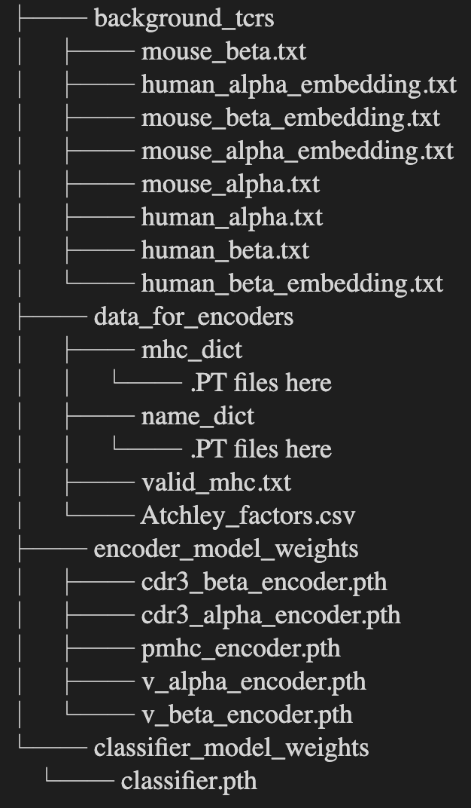

Installation Guide 
===================

Dependencies
-------------
The dependencies of pMTnet Omni is fairly standard for a deep learning-based application

.. list-table:: Dependencies
  :widths: 50 50
  :align: center
  :header-rows: 1

  * - Package 
    - Version 
  * - python
    - ``>=3.9``  
  * - numpy
    - ``==1.22.4``
  * - pandas
    - ``==1.5.2``
  * - matplotlib
    - ``==3.6.2``
  * - scikit-learn
    - ``==1.0.2``
  * - tqdm 
    - ``==4.64.1``
  * - torch
    - ``==1.13.1``
  * - fair-esm
    - ``==2.0.0``

Environment Setup 
------------------
.. _installation guide:

Of course, you can create your own environment and install those dependencies manually. 
However, we have made this simple for you.

* Go to `our website <http://lce-test.biohpc.swmed.edu/pmtnet>`_ and download the environment files. Or, run 
  
  .. code:: bash 
    
    git clone https://github.com/Yuqiu-Yang/pMTnet_Omni.git
* CD to the directory that contains both `pMTnet_Omni_env.yml` and `requirements.txt` files
* Run the followig  
  
  .. code:: bash 
    
    conda env create -f pMTnet_Omni_env.yml

This will create a conda environment *pMTnet_Omni*

Package Installation
------------------------

.. code:: bash

   conda activate pMTnet_Omni
   pip install pMTnet_Omni
  
To quickly test if it has been installed:

.. code:: bash

  python -m pMTnet_Omni --version 

For a more thorough test of the installation using the validation 
data we published, please check out :doc:`quick_start`. This will 
also serve as a quick start guide. 

Supporting Data Download 
-------------------------
pMTnet Omni requires some additional data to make accurate predictions. These files 
are too large (around 30Gb) to be stored on our `GitHub repo <https://github.com/Yuqiu-Yang/pMTnet_Omni>`_

These include:

* Model weights 
* A large number of background TCRs
* Output of the legendary ESM algorithm

Go to `our website <http://lce-test.biohpc.swmed.edu/pmtnet>`_ and download the data file 
if you have not already done so. 
The name of the directory can be changed to whatever you want (of course, it has to conform
with your system's naming convention) and the directory can be stored wherever you want. 

However, contents of the directory should **NOT** be altered for pMTnet Omni to execute properly.

The structure of the directory should look like this 

We also provide a function to help you check if a 
directory satisfies the requirements for a data directory. 
Execute the following by replacing the path to your path to the directory.

.. code-block:: python 

  # Import the function 
  from pMTnet_Omni.utilities import check_data_dir_structure

  data_dir_path = "/path/to/your/directory"

  check_data_dir_structure(data_dir_path)

If the function returns the paths to the model weights of all the 
encoders and the classifier (they can be Python `None` object if no 
weights are found), the structure of the directory is correct.
Otherwise, the function will raise an exception. 

