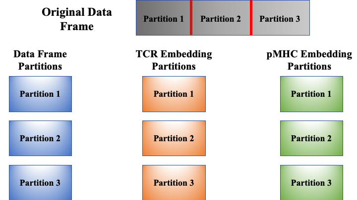
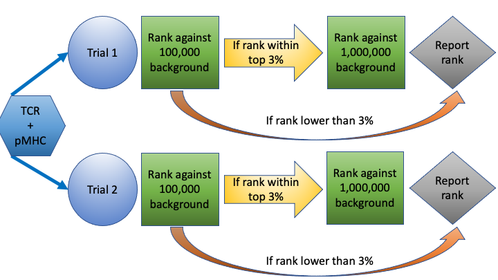
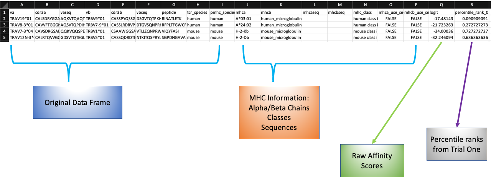

pMTnet Omni Tutorial
====================
So I see you want to get into the nitty gritty details of our package. While our :doc:`../api_reference/index`
provides all the details of the functions and classes defined in the package, 
it could be a bit overwhelming. In this relatively detailed tutorial, we will 
provide an in-depth exploration of how the package works. 

.. note:: 
    We will assume that the path to the directory containing all the background 
    TCRs as well as other supporting data is `./data`

    And the user has already imported the class using the command:

    .. code-block:: python
        
        from pMTnet_Omni.pMTnet_Omni_class import pMTnet_Omni_class

Instantiate a **pMTnet_Omni_class** Object
--------------------------------------------
It's relatively straightforward to instantiate a **pMTnet_Omni_class** object.

* Use the default setting
  
  .. code-block:: python 

    ###############################################
    # Use the default setting:
    # pMTnet_Omni will try cuda:0 if it's available 
    # Otherwise, it will use cpu
    pmtnet = pMTnet_Omni_class(data_dir="./data")
* Specify the device via a string
  
  .. code-block:: python
    
    # CPU:
    pmtnet = pMTnet_Omni_class(model_device="cpu",
                               data_dir="./data")

    # GUP: 
    pmtnet = pMTnet_Omni_class(model_device="cuda:0",
                               data_dir="./data")
* Use the ``torch.device`` function 
  
  .. code-block:: python 
    
    # Set the model device 
    model_device = torch.device(
            'cuda:0' if torch.cuda.is_available() else 'cpu')
    pmtnet = pMTnet_Omni_class(model_device=model_device,
                               data_dir="./data")
* Seed 
  
  .. code-block:: python 

    #To set seed to ensure reproducible results
    pmtnet = pMTnet_Omni_class(data_dir="./data",
                               seed=42)

The entire process will take several seconds as **pMTnet_Omni_class** will 
load the models and build necessary dictionaries for future usage. 

Import Data 
------------------------
As the `read_user_df` method calls the `read_csv` function in the `pandas` package,
the first three arguments: *user_data_path*, *sep*, and *header* are fairly standard. 
The final argument `partition_size`, however, worth some explanation. 

During our internal testing, we found that while a mediocre GPU is capable 
of handling several to hundreds of pairs, for dataset containing thousands of 
TCR-pMHC pairs, we usually will run out of memory. Partitioning the original 
data frame is a simple yet effective remedy. 

.. note:: 
    We will assume that the path to the user's data is `./df.csv`, and 
    it contains 5000 TCR-pMHC pairs 

By calling 

.. code-block:: python 

    pmtnet.read_user_df(user_data_path="./df.csv",
                        sep=",", header=0,
                        partition_size=2000)

**pMTnet_Omni_class** will partition the original data frame into three partitions with 
2,000, 2,000, and 1,000 pairs, respectively.

Predict TCR-pMHC Affinity
---------------------------
Although technically there is only one method you need to call 
to make the final TCR-pMHC affinity prediction, under the hood, a 
lot of data manipulation steps are taking place. In this subsection,
we will break down the entire process so that by the end of the document,
you should feel confident about using the ``predict`` method. 

In general, to get the final percentile ranks for each one of the 
TCR-pMHC pairs you provide in the dataframe, two steps are involved:
**getting the raw affinity scores** and 
(you guessed it) **computing the percentile ranks**. 

Raw Affinity Scores 
~~~~~~~~~~~~~~~~~~~~~~~
Deep learning algorithms manipulate real numbers. Ergo, the 
first thing that **pMTnet Omni** does is converting strings to 
real numbers. This is accomplished via the "internal" method: 

.. code-block:: python 

    pmtnet._encode_user_df()

If the user is using GPU, **pMTnet_Omni_class** will transfer
each partition to GPU, compute the TCR embedding and the pMHC embedding, and 
transfer the results back to CPU. Therefore, only the model and one partition 
of the original data will live on GPU. For this method, we provide an argument ``verbose``. If ``True``, 
we will print out the encoding process. 

Once we have encoded all the strings, the second is straightforward: 
invoking to classifier to produce raw affinity scores. This is achieved 
via yet another "internal" method: 

.. code-block:: python

    pmtnet._get_user_df_output()

.. note:: 
    This is at this point we introduce an argument 
    ``compute_percentile_rank``. If set ``False``, the 
    program will halt. And only the raw affinity scores will 
    be reported. If ``True``, the program will proceed to the 
    next stage.

Percentile Ranks 
~~~~~~~~~~~~~~~~~~~~~~~~
In this stage, we will compare each pair with the background TCRs. As 
we have millions of background TCRs, it would be time consuming to check 
each pair against the entire database. Hence, in our implementation, we borrowed 
an idea from the literature of clinical trials.

Each TCR-pMHC pair will undergo one or several "trials", each with a 
sequence of `checks`. The procedure is conceptually simple: 

Within a "trial", each TCR-pMHC pair will be first checked against a small 
subset of the background TCRs. If the resulting rank is high enough, we sample 
a larger subset of the background TCRs and check the given pair against them. 
The process repeats until either the pair falls out of the top rank list or 
it has been validated against enough background TCRs, at which point, the 
algorithm reports the final rank. 

With that in mind, the final percentile ranks are computed via 

.. code-block:: python 

    pmtnet._compute_percentile_rank(rank_threshold=0.03, # We only consider pairs within top 3%
                                    B=1, # Only one trial will be carried out 
                                    load_embedding=True, # When loading the background TCRs, we will load their embeddings instead of the raw sequences 
                                    replacement=True, # When sampling from background TCRs, we sample with replacement 
                                    check_size=[10000, 100000, 1000000], # We will first check against 10,000 and then 100,000 and then 1,000,000 background TCRs
                                    load_size=1000000, # Each trial will involve at most 1,000,000 background TCRs from each set
                                    minibatch_size=50000, # Each minibatch will involve 50,000 background TCRs
                                    log_file_path=None # No log file is needed 
                                    )

Two parameters ``load_size`` and ``minibatch_size`` could be somewhat confusing. But they 
are implemented to further speed up the prediction process. 

``load_size`` is implemented so that for each trial, only that many background TCRs will 
be potentially used. This is because the background TCRs datasets are relatively large, 
meaning that initializing the dataloaders will be time consuming. 

``minibatch_size`` is how many background TCRs the dataloader will sample within a check_size.
For example, is the current check_size is 2,000 and the minibatch_size is 1,000. Then 
the dataloader will first load 1,000 TCRs, compute the rank, load another 1,000 TCRs, and 
update the rank. This will speed up the process as directly load, say 1,000,000 TCRs will 
be slow. 

Finally, if ``output_file_path`` is not ``None``, we will 
"glue" all the partitions back together and output a ``.csv``
file at the specified location. 

.. code-block:: python 

    # We just need the data dictionary
    # The other two are TCR and pMHC embedding dictionaries
    df_dict, _, _ = pmtnet._amalgamate()

.. note:: 
    The name of the ``.csv`` file saved by the program will have 
    ``_complete`` appended to the original file name. For example,
    if ``output_file_path='./df_results.csv'``, the actual file will 
    be saved as ``'./df_results_complete.csv'``. 

The ``predict`` Method
~~~~~~~~~~~~~~~~~~~~~~~~~~
The ``predict`` method you saw in :doc:`/quick_start` is simply a 
wrapper of all the "internal" methods we just walked you through. 
Hence, in actuality, you only need 

.. code-block:: python 

    pmtnet.predict(verbose=True,
                   create_incomplete_data=False, # This is only used for validation
                   compute_percentile_rank=True, # Final percentile ranks are needed
                   output_file_path='./df_results.csv',
                   rank_threshold=0.03, # We only consider pairs within top 3%
                   B=1, # Only one trial will be carried out 
                   load_embedding=True, # When loading the background TCRs, we will load their embeddings instead of the raw sequences 
                   replacement=True, # When sampling from background TCRs, we sample with replacement 
                   check_size=[10000, 100000, 1000000], # We will first check against 10,000 and then 100,000 and then 1,000,000 background TCRs
                   load_size=1000000, # Each trial will involve at most 1,000,000 background TCRs from each set
                   minibatch_size=50000, # Each minibatch will involve 50,000 background TCRs
                   log_file_path=None # No log file is needed 
                   )

.. note:: 
    We explicitly specified all the arguments of the ``predict`` method 
    for the sake of clarity. However, you can use some of the default 
    values to make your life slightly easier. Check out 
    :doc:`/api_reference/pMTnet_Omni_class` for the details.

Sample Output
~~~~~~~~~~~~~~

